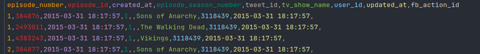
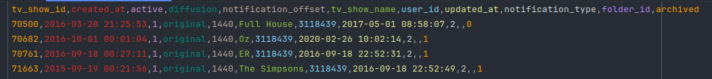
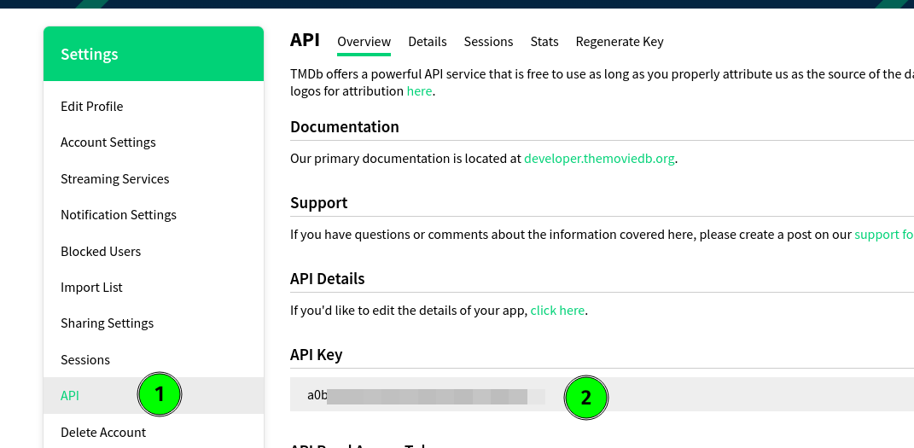
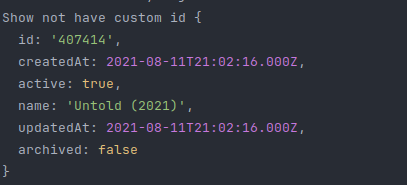
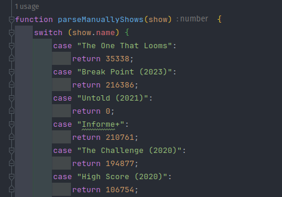
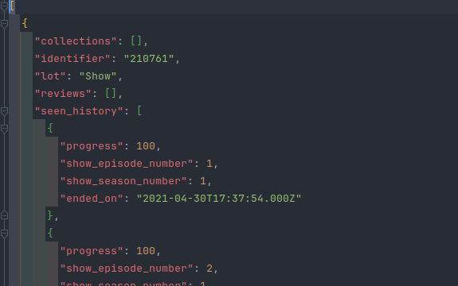
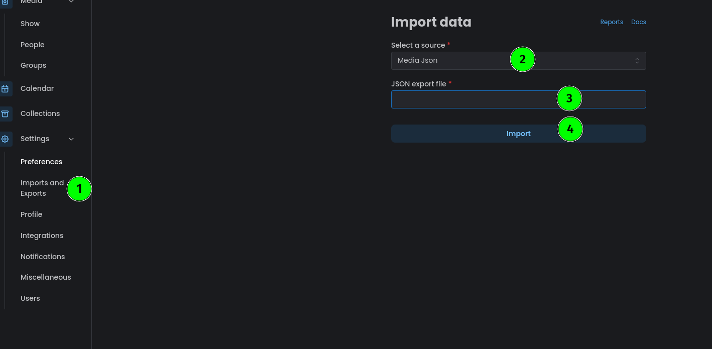

# TvTime to Ryot

## Information

This is a personal project, that could be interesting for other people in the same situation as I was.

I discovered [Ryot](https://github.com/IgnisDa/ryot), and wanted to start to use it to track the TV shows I watch.

Until now, I was using [TvTime](https://www.tvtime.com/) to store this information, but as I want to keep 100% control of my data, I chose [Ryot](https://github.com/IgnisDa/ryot).

So this is a small script to automatize the export of my ratings from [TvTime](https://www.tvtime.com/) and generate a JSON with following the Ryot's specification to import them into [Ryot](https://github.com/IgnisDa/ryot).

> Run this script and import the data on you own risk, I recommend try it first on an empty instance of Ryot to avoid data loses, or at least make some backups if you have some previous data.

## Requirements

- You need an export from TvTime.
- You need an api key from [The Movie Database](https://www.themoviedb.org/) in order to match the results from the TvTime's CSVs to Ryot.
- You need an instance of [Ryot](https://github.com/IgnisDa/ryot)

### Get your Data from TV Time

TV Time's API is not open. In order to get access to your personal data, you will have to request it from TV Time's support via a GDPR request - or maybe just ask for it, whatever works, it's your data.

Copy the template provided by www.datarequests.org into an email
Send it to support@tvtime.com
Wait a few working days for their team to process your request
Extract the data somewhere safe on your local system

### Work on it!

When you get your TvTime copy with your data, you will need to take only two files into account.

You need to import these files in the same place that you have the `tvtime-to-ryot.js file.

Here are some small examples of the content of the two CSV files. `followed_tv_show.csv` and `seen_episode.csv

> seen_episode.csv

> followed_tv_show.csv

## Usage

At the top of the script, you can find some strings with the text **FILL_WITH_YOUR_VALUE**, just replace it, with your own values.

- `tmdb_api_key`: here you need to take the api key from your profile in the movie database.

## Run

To run the script, just be sure that you have node installed on your computer, at least Node 18.*

`npm install`

`node tvtime-to-ryot.js`

While the script is running you get some information about the process of importing data.

## Troubleshooting

Is it possible that in your lists from TvTime, you get some programs that could not be correctly identified with The Movie Database API, in that case, you get printed an error indicated you have a show without an ID, in that case you can try to find it manually the ID in The Movie Database website, and pasted in the section CustomIds.

I left in the script all the ones I found issues with, so maybe you can use them.

## Import to Ryot

Finally, when all the process finish, you should have a file named `tvshows-ryot.json`, that looks something like that.

After this you should just import this file into your Ryot instance.

Navigate in your browser to Ryot, and click on **_Imports and Exports_**, select **_Media Json as source_**, and **_the file_**, press **_import_** and wait a bit, and everything should be fine.

